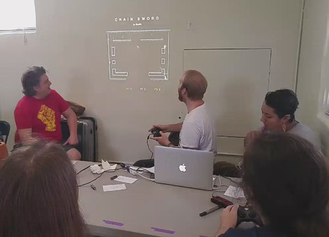
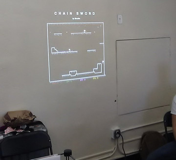

# CHAIN SWORD

CHAIN SWORD is a small single-screen multiplayer game, where you try to defeat the other players using a sword that is also a grappling hook.

## Play

[Web](http://eight45.net:8000/chain-sword) | [Windows](http://eight45.net:8000/chain-sword/CHAIN_SWORD-win.zip) | [Mac](http://eight45.net:8000/chain-sword/CHAIN_SWORD-mac.zip) | [Linux](http://eight45.net:8000/chain-sword/CHAIN_SWORD-linux.AppImage)

Two players can play with one keyboard: `WASD + O, P` and `ARROWS + Z, X`.

Or you can play with gamepads, which supports up to four players at once. This is by far the most enjoyable way to play.

## Photos

A couple of pictures of CHAIN SWORD being played at local bay area indie gamedev events.

